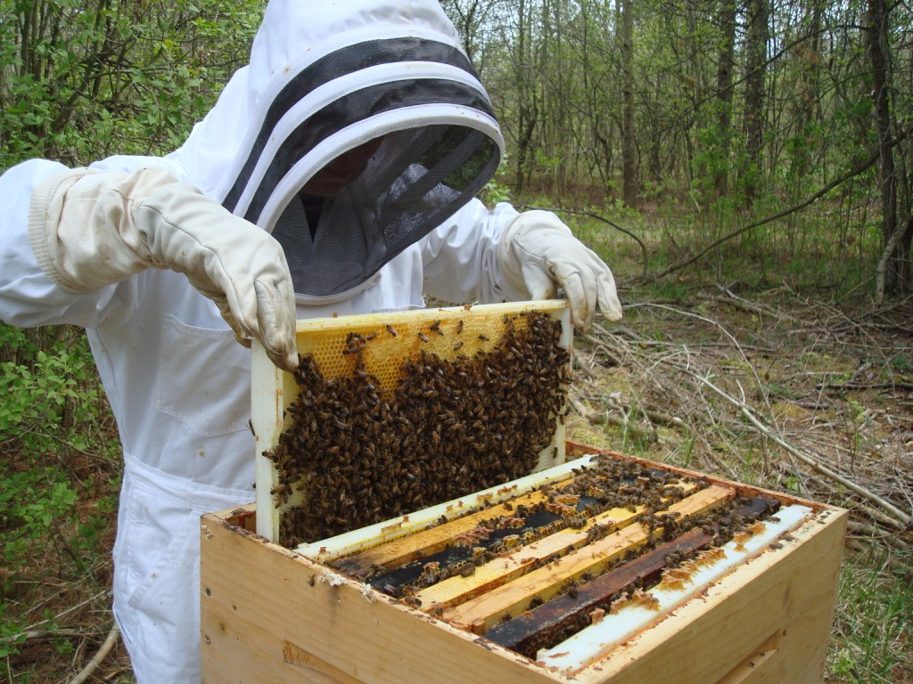

# Component-Based Web Design

Emma Jane Westby 
 [@emmajanehw](http://twitter.com/emmajanehw) // [emma.westby@drupalize.me](mailto:emma.westby@drupalize.me)

---------------------------------------
## Hello! My Name is Emma

Note: Emma has been doing Drupal 10+ years, started from scratch all the way to core contributor, passionate about version control and developer workflow, former front end dev.