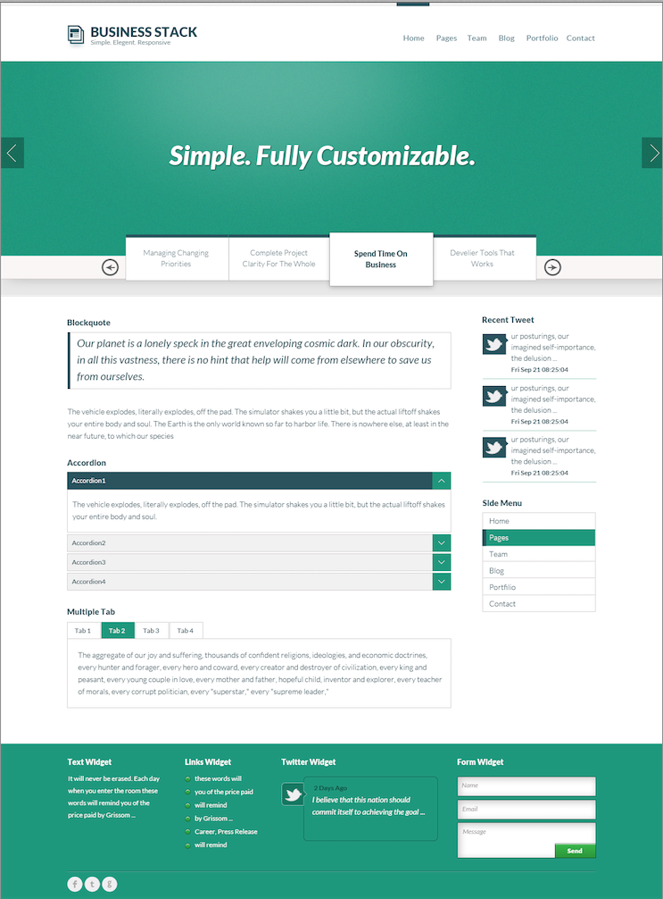

# Component-Based Web Design

Joe Shindelar // [@eojthebrave](http://twitter.com/eojthebrave) // [joe.shindelar@drupalize.me](mailto:joe.shindelar@drupalize.me)

Amber Matz // [@amberhimesmatz](http://twitter.com/amberhimesmatz) // [amber.matz@drupalize.me](mailto:amber.matz@drupalize.me)

Kyle Hofmeyer // [@khofmeyer](https://twitter.com/khofmeyer) // [kyle.hofmeyer@drupalize.me](mailto:kyle.hofmeyer@drupalize.me)

---------------------------------------
## Hi!

Note: 

---------------------------------------
## What We're Going to Do

1. Review and discuss pattern libraries.
2. Create a pattern library for a given design.
3. Organize styles according to SMACSS conventions.
4. Write pseudo-code for our styles.
5. Learn how to apply component based development to Drupal.
6. Review sample style guides.

Note: Summary, this workshop is all about recognizing patterns, naming, and organizing things

---------------------------------------
## Who is this for?

---------------------------------------
## Team Members Who Want To:

- Use a common vocabulary for team communication
- Reap the benefits of reusable code
- Ramp up newcomers to the project quickly

---------------------------------------
## Slides, Resources, and more

- http://lb.cm/austin-slides
- https://github.com/DrupalizeMe/drupal7-psdtotheme-series

---------------------------------------
## Grab the Files: http://lb.cm/free-psd

<!-- .slide: data-background-image="assets/AnggaPutra_blog_psd.png" -->
<!-- .slide: data-background-position="top left" -->
<!-- .slide: data-state="bgimage" -->

Note: Link points to download for green theme PSD -- Design is (c) CC BY-NC-ND, Angga Putra. Source: http://www.behance.net/gallery/Business-Stack-Free-Template-%28-PSD-file-included-%29/9254421 the PNGs and PSD files are also hidden in the repo.

---------------------------------------
## Pro Tip
“Are you new to front-end web development? Here's a secret: no one else really knows what they're doing either.”


Nicolas Gallagher

Note: One of the things that makes this topic particularly difficult is that the field is changing so rapidly.

---------------------------------------
## ... but

Efficient front end developers have
a series of patterns in mind when they convert a design into a working web site.

This is how we do it.

 ... or rather:
 This is how we'd do it today if we were starting over.

---------------------------------------
## Quick Vocabulary Lesson

- Page or Design or Mock
- Layout Styles or Layout Rules
- Component or Pattern
- Base or Global (Rules and Styles)
- Element
- Modifier or State

---------------------------------------
## Page

Note: Corresponds to a URL; contents may vary depending on the viewport width. Is divided into sections by Layout Rules.

---------------------------------------
## Layout

Note: The layout divides a page into regions. The regions will hold our elements. Layouts are typically based on grid frameworks.

---------------------------------------
## Base

Note: Things which remain consistent from page-to-page, and which are not components, are typically described by base styles.

---------------------------------------
## Component

Note: Components may be build from smaller elements. If a component never changes state or has only one element, it may be defined in the base styles. Your choice.

---------------------------------------
## Elements and Modifiers / State

Note: Components are built from elements. Elements may have different states. Components may also have different states e.g. responsive "narrow" vs "desktop" variants.

---------------------------------------
## Containers: Page > Layout Rules  Objects: Components > Elements

