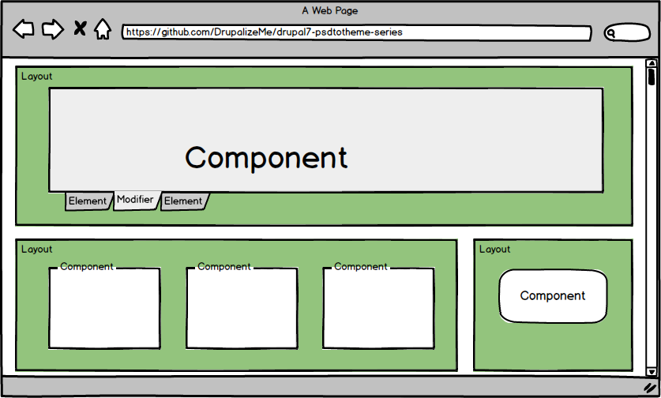
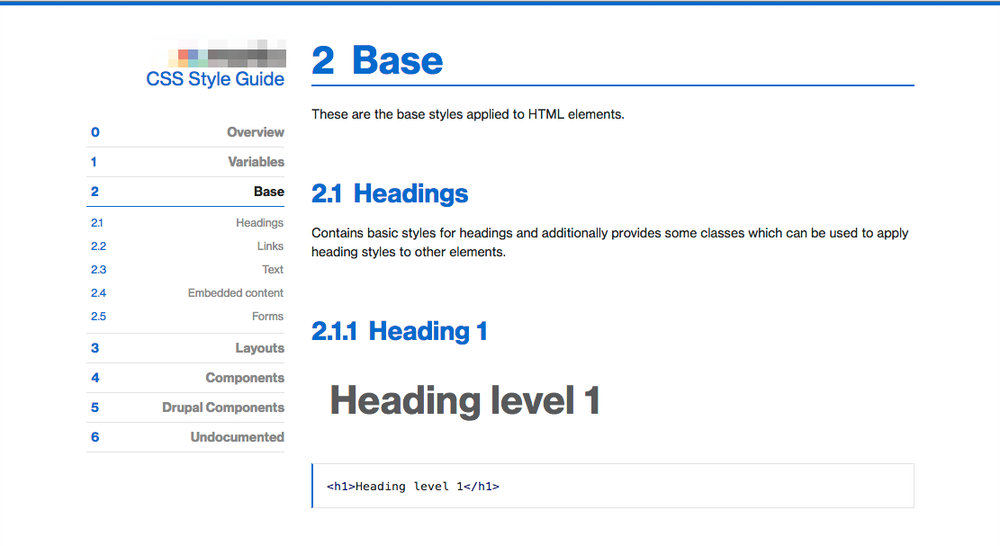
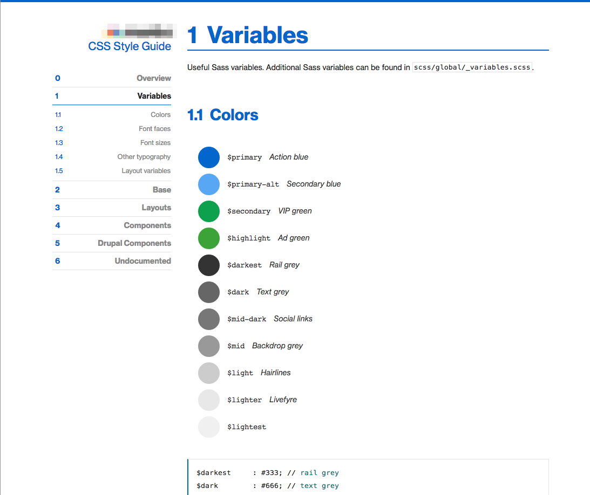

## What We're Going to Talk About

1. What is component-based front end development
2. Sample pattern libraries
3. Converting a design to its components
4. Sample output style guides

-----
## What We're<br />NOT Going to Talk About

- OOCSS and cross-browser compatibility [10:30AM - Ski-U-Mah](http://minnewebcon.org/session/front-end-development-for-back-end-developers/)
- How to Sass [2:30PM - Ski-U-Mah](http://minnewebcon.org/session/the-hitchhikers-guide-to-sass/)

Note: there are a lot of great sessions happening. I won't be offended if you leave. So if you're looking for a Sass tutorial, or cross-browser shenanigans, you should probably come back later on for one of the other excellent front end dev sessions happening here today.

-----
## Slides

- Repo: http://lb.cm/mwc-repo
- Rendered slides: http://lb.cm/mwc-2014

Note: the repo has all related sources, but can be a pain to sift through. The rendered slides is just this deck.

=====
## Terms and Definitions

Note: We need to start with some terms and definitions. Although I'm a bit loose with my terms, I'm not always using words exactly the way you may have seen others describe these same problems.

-----
## What is a Web Page?

"A page is a unit of business intent."

Michael Keara

-----
## What is a Component?

A component is an identifiable collection of related elements found throughout a Web site.

-----
## Components are<br />the Building Blocks of Pages



Note: Pages contain layout rules, which contain components, which contain elements, which might be in one or more states

-----
## What is a Design Pattern?

A design pattern is a component which has been abstracted to remove the styling and content specific to a particular Web site.

Note: Components can be abstracted into Design Patterns. I will typically shorten "Design Pattern" or "UI Pattern" to simply "pattern".

-----

<!-- .slide: data-background-image="assets/pattern-list.png" -->
<!-- .slide: data-background-position="top left" -->
<!-- .slide: data-state="bgimage" -->


Note: Patterns are abstracted components. Components are rendered patterns.

-----

Efficient front end developers have
a series of patterns in mind when they convert a design into a working web site.

<span class="fragment">This is how I do it.</span>

-----
## Train Your Eye Using Established Pattern Libraries

Stop thinking in "pages" and start thinking in "components".


-----
## [pea.rs](http://pea.rs/)

<!-- .slide: data-background-image="assets/pears.png" -->
<!-- .slide: data-background-position="top left" -->
<!-- .slide: data-state="bgimage" -->


Note: a theme for WordPress which you can redecorate. Gives you all of the patterns / components broken down so that it's easier to find the HTML / CSS that you need to style. Intended for working quickly with WordPress.

-----
## [patternlab.io](http://patternlab.io/)

<!-- .slide: data-background-image="assets/patternlab.png" -->
<!-- .slide: data-background-position="top left" -->
<!-- .slide: data-state="bgimage" -->


Note: a static site generator (PHP + Mustache templates) which has all of your patterns / components broken down. Used for rapid prototyping, but not necessarily your final build. HTML elements = atoms; Sub-components = molecules; Components = organizisms; templates; pages. You might want to use a tool like this to prototype your components, or you might want to develop your own.

-----
## [Yahoo Design Pattern Library](http://developer.yahoo.com/ypatterns/)
<!-- .slide: data-background-image="assets/yahoo_design_patterns.png" -->
<!-- .slide: data-background-position="top left" -->
<!-- .slide: data-state="bgimage" -->


Note: An enterprise-level description of patterns and WHY you would want to use them; and how the user is expected to interact with them. Does not include code output (this is stored separatedly). This is starting to get "away" from what we'll be building.

-----
## [UI Design Patterns](http://ui-patterns.com/)

<!-- .slide: data-background-image="assets/uipatterns.png" -->
<!-- .slide: data-background-position="top left" -->
<!-- .slide: data-state="bgimage" -->


Note: Similar to the Yahoo! Design pattern library, but this one is a community collaboration instead of an example of how ONE corporation creates interface design patterns.

-----
## Summary:<br/>Components and Pattern Libraries

- A component is an identifiable collection of related elements found throughout a Web site.
- Components are collected in layouts, and then displayed as rendered pages by a browser.
- By studying existing pattern libraries, you will train your brain to recognize patterns in your own designs.

=====
## Organizing Your Components into a Usable System

Note: your web site may have 100s of patterns. 

-----
## Use Established Conventions

Frameworks allow us to quickly apply standardized conventions to a design so that we can quickly find our work later.

Note: DRY: Don't repeat yourself. WET: We enjoy typing / write everything twice. 12,000 lines of CSS is fun to maintain.

-----
## File Organization, and<br />Class Naming Conventions

- [OOCSS](http://github.com/stubbornella/oocss/wiki) - Object Oriented CSS - Nicole Sullivan
- [SMACSS](http://smacss.com/)* - Scalable and Modular Architecture for CSS - Jonathan Snook
- [BEM](http://bem.info/method/) - Block, Element, Modifier
- [ACSS](http://bradfrostweb.com/blog/post/atomic-web-design/) - Atomic CSS - Brad Frost

<p style="text-align: left; margin-top: 1em" class="fragment fade-in">my fave is SMACSS-ish</p>
<p style="text-align: left; margin-top: 1em" class="fragment fade-in">the session immediately after this one will cover OOCSS</p>

-----
## "Conventions" Assume<br />You are Using a CSS Pre-Processor

Which allows you to ...

- streamline the CSS you write.
- use variables in your CSS.
- adopt complicated grid systems easily.
- fudge semantics by extending / reusing class names.

-----
## CSS Pre-processors for DRYer Development

- [Sass](http://sass-lang.com/)
- [Less](http://lesscss.org/) 
- [Stylus](http://learnboost.github.com/stylus/)
- [Comparison of pre-processors](http://code.tutsplus.com/tutorials/sass-vs-less-vs-stylus-preprocessor-shootout--net-24320)

<p style="text-align: left; margin-top: 1em" class="fragment fade-in">Learn Sass at 2:30 in this room!</p>

Note: DRY is "don't repeat yourself". WET is "we enjoying typing"

-----
## Frameworks Give us "Smart" Starting Points for Prototyping

- [Bootstrap](http://getbootstrap.com/)
- [Foundation](http://foundation.zurb.com/)
- [Susy](http://susy.oddbird.net/)
- [Bourbon](http://neat.bourbon.io/) and [Neat](http://neat.bourbon.io/)

-----
## Summary:<br />Conventions and Frameworks

- OOCSS, SMACSS, and BEM are all organizational **conventions** which offer recommendations on how to structure your CSS files and classes so they are easier to use.
- Sass, Less, and Stylus are all **CSS pre-processors** which allow you to write "DRY"er CSS.
- Bootstrap, Foundation, and Susy are all **frameworks** which give you sample CSS classes / styles so that you don't have to write CSS from scratch.

Note: Master a convention before you try to outgrow its framework. Never be afraid to refactor, or throw away a convention which is working against you.

=====
## Converting a Design

<!-- .slide: data-background-image="assets/domicile.png" -->
<!-- .slide: data-background-position="top left" -->
<!-- .slide: data-state="bgimage" -->

Note: This is how I converted the following design. 

-----
## ASSUMPTION ALERT!

I assume you are working with a CMS which generates a fairly predictable HTML output.

(And so I'll only mention styles, but of course you need to tie these classes to your HTML as well.)

-----
## Use a Pattern Library to Identify Components

<!-- .slide: data-background-image="assets/domicile-components.png" -->
<!-- .slide: data-background-position="top left" -->
<!-- .slide: data-state="bgimage" -->

Note: Describe Your Design in Words: navigation x 3; banner at the top; quotes in the middle; intro para x 2; slats x 2

-----
## Write Text Descriptions of Your Components

````
Featured (4 columns) - Quotes and images

- primary decoration
- image of a plate + headings
- Sample design: component-feature-decoration-primary.png
````

-----
## Collect Assets<br />From Your Design Files

I typically do this by merely cropping relevant images I'll need.


Note: You may need to embed these into your HTML files, or you may use them as CSS backgrounds. it depends on what the image is.

-----
## Organize the Text Descriptions into<br />SMACSS-ish Categories


Note: Styles aren't perfectly organized. There's often overlap between different kinds of styles.


-----
## Separate the Text Descriptions<br />Into Their Own Files

Sample file names:

- scss/components/
  - _blog.scss
  - _gallery-item.scss
  - _portfolio-item.scss
- scss/layout/
  - _default.scss
  - _single-column.scss
- scss/base.scss
- scss/styles.scss (pulls in all partials)

-----
## Convert the Text Descriptions to Pseudo Code

- File name: ``components/_name-of-component.scss``
- Sample Sass:

````
.name-of-component {
  __title {
    @extend h3;
  }
  __date {
    @extend .subtitle;
  }
  __description {
    @extend p;
  }
}
````

Note: for the class name conventions, I like to use BEM. You can also use HTML elements if you know the structure of the HTML.

-----
## Identify the Containers<br />You Can Put Components Into

<!-- .slide: data-background-image="assets/domicile-regions.png" -->
<!-- .slide: data-background-position="top left" -->
<!-- .slide: data-state="bgimage" -->


Note: the domicile design with three layout columns highlighted in yellow

-----
## Describe the Containers<br />(Layout Rules)

- Name
- Terse description
- Number of grid columns for each area

````
- Banner Area -- large image - 12 grid columns
- Navigation area -- left column - 2 grid columns
- Featured area -- center column - 4 grid columns
- Content area -- right column - 6 grid columns
- Copyright area -- footer - 12 grid columns
````

-----
## Convert Layout Descriptions into Pseudo Code

File: `layout/_default.scss`

````
$ninesixty-columns: 12;

.fullwidth {
  @include grid-container;
  
  #nav {
    @include grid(2);
  }

  #featured {
    @include grid(4);
  }

  #content {
    @include grid(6);
  }
}
````
Note: SMACSS says you can use IDs; BEM says you can't.

-----
## Describe<br/>Remaining and Repeated Styles<br />(Base Rules)

- HTML element overrides.
- CSS variables (e.g. colors).
- CSS reusable chunks (e.g. mixins for rounded corners).

-----
## Write Pseudo Code for Base Rules

File name: ``base/_base.scss``

````
/* Colors: */
$default = #666666 // darker gray
$headings = #999999 // headings
$accent_primary = #336666 // greenish
$accent_secondary -- #996633 // brownish

/* Reset HTML elements */
h1, h2, h3 {
  color: $headings;
  margin-bottom: 0;
}
````

-----
## Open Your Browser and<br />Prepare to Refactor

You won't get your components perfect the first time.

Be kind to yourself: use version control, and refactor styles that aren't working for you.

Note: now is the time to apply your styles to HTML.

-----
## Summary:<br />Converting Conventions to Code

- Convert your design into words.
- Group the words according to an organizational framework, such as SMACSS.
- Write the pseudo-code for your styles using a CSS class naming convention, such as SMACSS or BEM.
- Locate and simplify duplicate styles by using CSS Preprocessor variables and mixins.
- Opt for many small files to avoid version control conflicts when refactoring.
- Iterate and improve in the browser.

=====
## And When It's Done...

Create a style guide so that you have a human-readable summary of your CSS.

-----
## Style Guides

There are essentially three types of style guides:

- Plain text, with screen shot / picture references
- Curated style pages
- Automated style guides

-----
## Style Guide: Curated Style Pages

- Curated style pages gives you an examples of what the rendered CSS should look like in a browser. 
- These are generally compiled at the end of the design phase; however, front end developers should consider having an in-code style guide as well (or instead of) this type of style guide.

-----
## Examples of Curated Style Pages

- [Herokuapp](http://sfdc-styleguide.herokuapp.com/)
- [GitHub](https://github.com/styleguide/css/1.0)
- [MailChimp](https://ux.mailchimp.com/patterns/)
- [Code for America](http://style.codeforamerica.org/)
- [Starbucks](http://www.starbucks.com/static/reference/styleguide/)
- [Drupalize.Me (unfinished)](http://justinharrelllullabot.github.io)
- For more [info about curated style pages](http://24ways.org/2011/front-end-style-guides/)...

-----
## Sample Curated Style Page


-----
## Style Guide:<br/>Automated Style Guides

- Documentation should be put as close as possible to the place where it will be used. 
- Any time documentation is abstracted, or re-written, and put into a different location it risks becoming out of date.

- [kss-node](https://github.com/hughsk/kss-node) which is based on [Knyle Style Sheets](http://warpspire.com/kss/styleguides/)
- [Tdcss.js](http://jakobloekke.github.io/tdcss.js/)
- [Kalei Style Guide](http://kaleistyleguide.com/)
- [StyleDocco](http://jacobrask.github.io/styledocco/)
- [Pattern-Primer](https://github.com/adactio/Pattern-Primer)

Note: The following automated style guides are still "works in progress" and not necessarily current best practices for compiling style-related documentation.

-----
## Sample Automated Style Guide



-----
## Sample Automated Style Guide




-----
## Resources

- Repo: http://lb.cm/mwc-repo
- Rendered slides: http://lb.cm/mwc-2014
- Opinionated shenanigans on Twitter: [emmajanehw](http://twitter.com/emmajanehw)
- High quality link feed on Twitter: [drupalizeme](http://twitter.com/drupalizeme)