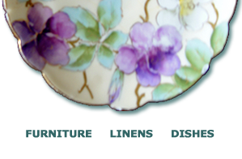

## What We're Going to Talk About

1. What is component-based front end development
2. Sample pattern libraries
3. Converting a design to its components
4. Sample output style guides

[Slides, Resources, and more](https://github.com/DrupalizeMe/drupal7-psdtotheme-series)

---------------------------------------
## Pro Tip
“Are you new to front-end web development? Here's a secret: no one else really knows what they're doing either.”


Nicolas Gallagher

---------------------------------------
## ... but

Efficient front end developers have a series of patterns in mind when they convert a design into a working web site. This is how I do it.

===============================================================================
## Pattern Libraries

Your web site is a collection of rendered component patterns.

---------------------------------------
## [pea.rs](http://pea.rs/)


---------------------------------------
## [patternlab](http://patternlab.io/)


---------------------------------------
## [Yahoo Design Pattern Library](http://developer.yahoo.com/ypatterns/)


---------------------------------------
## [UI Design Patterns](http://ui-patterns.com/)


---------------------------------------
## Insert Your Patterns Here


Note: not all components fit into a pattern neatly


===============================================================================
## Applying Patterns

---------------------------------------
## Use Established Conventions

Frameworks allow us to quickly apply conventions to a design.

Note: Web development is like that time you realized you were a grown-up and you **could** eat cake every day for breakfast, but also understanding **why** you shouldn't.

---------------------------------------
## File Organization and Class Naming Conventions

- [OOCSS](http://github.com/stubbornella/oocss/wiki) - Object Oriented CSS - Nicole Sullivan
- *[SMACSS](http://smacss.com/) - Scalable and Modular Architecture for CSS - Jonathan Snook
- [BEM](http://bem.info/method/) - Block, Element, Modifier
- [ACSS](http://bradfrostweb.com/blog/post/atomic-web-design/) - Atomic CSS - Brad Frost

* my fave

---------------------------------------
## CSS Pre-processors

- Allows you to streamline what you write (and output variations after processing).
- Allows you to use variables and short-cuts in CSS (colours! rounded borders!).
- Allows someone else to write complicated grid systems which you can easily apply to your site.
- Allows you to fudge semantics.

---------------------------------------
## Pre-processors

- [Sass](http://sass-lang.com/)
- [Less](http://lesscss.org/) 
- [Stylus](http://learnboost.github.com/stylus/)

Comparison: http://code.tutsplus.com/tutorials/sass-vs-less-vs-stylus-preprocessor-shootout--net-24320

---------------------------------------
## Frameworks and Toolkits

- [Bootstrap](http://getbootstrap.com/)
- [Foundation](http://foundation.zurb.com/)
- [Susy](http://susy.oddbird.net/)
- [Bourbon](http://neat.bourbon.io/) and [Neat](http://neat.bourbon.io/)

---------------------------------------
## Roll Your Own!

- Master a convention before you try to outgrow its framework.
- Never be afraid to refactor, or throw away a convention which is working against you.

===============================================================================
## Concepts Applied

1. **Define your styles in text** according to a convention.
2. Use a pattern library to **identify design components**.
3. **Stub out HTML + CSS** to display your library of styles.
4. **Refactor the component styles** until they match the design.

-------------
## Sneak Peak


Note: this is the design we're going to be applying our libraries and patterns to.

-------------
## Using a Convention: [SMACSS](http://smacss.com/)

Describe the design in words, asking yourself:

1. What’s the shape?
2. What’s consistent?
3. What can be moved like furniture?

-------------
## 1. What's the Shape?

These are your layout rules.

-------------
## Identify the Grid


-------------
## Locate the Containers


-------------
## Abstract the Design to a Wireframe


---------
## Write Down Your Layout Rules

The shape of your web site, including the number of 
grid columns for each area.

- Banner Area -- large image - 12 grid columns
- Navigation area -- left column - 2 grid columns
- Featured area -- center column - 4 grid columns
- Content area -- right column - 6 grid columns
- Copyright area -- footer - 12 grid columns

---------------------------------------
## 2. What's Consistent?

These are typically your base, or global, rules.

--------
## Find the HTML Element-ish Styles

- Headings
- Paragraphs
- Links

---------
## Write Down Your Base Rules

HTML element re-writes that are consistent from
page-to-page.

- darker gray -- #666666 -- most text "default"
- lighter gray -- #999999 -- headings
- green ish -- #336666 -- primary accent colour
- brownish -- #996633 -- secondary accent colour
- font styling: mostly serif
(etc)

---------------------------------------
## 3. What Can be Moved Like Furniture?

Anything you can draw a box around is a component.

---------------------------------------
## Screen Captures Make Good Boxes 


Note: To easily identify components, start taking screen captures of your PSD file.

-----
## Write Down Your Components

Featured (4 columns) - Quotes and images

- primary decoration
- image of a plate + headings
- Sample design: component-feature-decoration-primary.png



Note: show the style guide for this


---------------------------------------
## Document All of Your Rules

Plain text (or Markdown) is fine!

````
Layout Rules
---------
The shape of your web site, including the number of 
grid columns for each area.

- Banner Area -- large image - 12 grid columns
- Navigation area -- left column - 2 grid columns
- Featured area -- center column - 4 grid columns
- Content area -- right column - 6 grid columns
- Copyright area -- footer - 12 grid columns

Reference:
layout-wireframe.png
layout-gridcols.png
````

======
## Converting Plain Text to Code

By using words to describe your design files, you can easily convert the text representation of the design into "code" (Sass / CSS) using [SMACSS](http://smacss.com) conventions.

- Shape becomes Layout Rules
- Consistency becomes Base Rules
- Furniture becomes Component Rules

Note: SMACSS is Scalable and Modular Architecture for CSS.

-------------
## 1. Layout: What's the Shape

``layout/_default.scss`` 

Create the layout rules for your grid framework of choice.

````
$ninesixty-columns: 12;

.fullwidth {
  @include grid-container;
  
  #nav {
    @include grid(2);
  }

  #featured {
    @include grid(4);
  }

  #content {
    @include grid(6);
  }
}
````
Note: Ideally the design will have used the templates for your CSS grid framework.


--------
## 2. Base: What's Consistent?

``base/_base.scss`` 

````
$default: #666666; // darker grey
$heading: #999999; // ligher grey
$accent1st: #336666; // greenish

h1, h2, h3 {
  color: $heading;
  margin-bottom: 0;
}
````

-----------
## 3. Components: Moveable Furniture

``components/_news-teaser.scss``

- Component styles should be reusable. 

````
.news-teaser {
  h2 { text-transform: uppercase; }
  p:first-child { color: $accent1st; }
  p { color: $default; }
}
````
- Put duplicate styles into variables and mixins.
- Match your file name to your style class.
