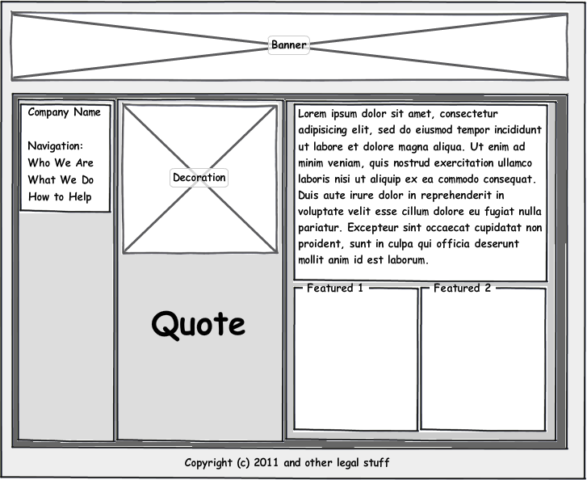
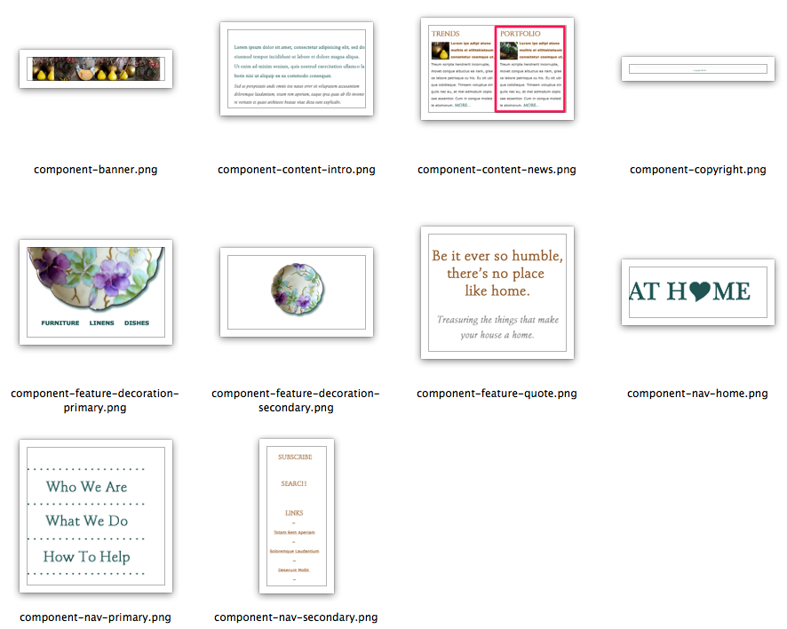
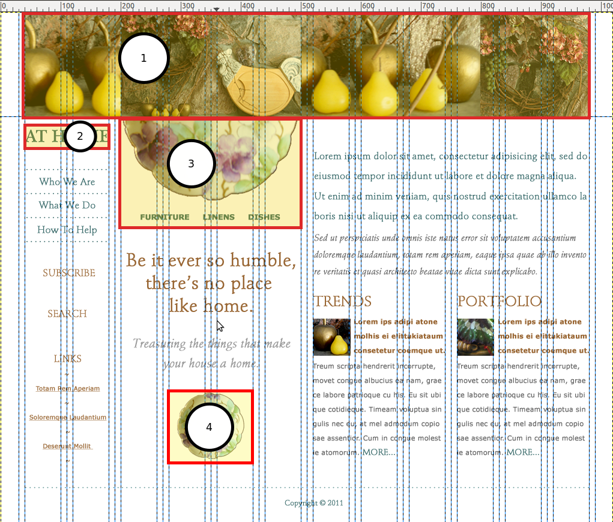
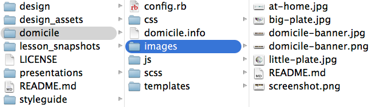

## What We're Going to Talk About

http://lb.cm/psdtotheme-acquia

---------------------------------------
## The Old Way to PSD to Theme

1. Sketch out the design components.
2. Choose an appropriate base theme.
3. Apply relevant static images to the main tpl.php files.
4. Launch the theme.
5. Create high specificity selectors to target and fix problems.

Note: This is how we used to do things.

---------------------------------------
## The New Way to PSD to Theme

1. Sketch out the design components.
2. Create a library of basic styles according to SMACSS convention.
3. Adjust Drupal class names to match style component names.
4. Look for bugs and refactor the component styles to match the design.


===============================================================================
## yeabuthow?!

---------
## You New Here?

“Are you new to front-end web development? Here's a secret: no one else really knows what they're doing either.”


Nicolas Gallagher

-------------
## The Three Magic Questions<br/>for PSD to Theme 

1. What’s the shape?
2. What’s consistent throughout the site?
3. What can be moved like furniture?

-------------
## Let's See It in Action


===============================================================================
## 1. What's the Shape?

These are your layout rules.

-------------
## Identify the Grid


-------------
## Locate the Containers


-------------
## Sketch the Essence 



-------------
## Abstract the Design to a Wireframe


-------------
## ``layout/_default.scss`` 

Create the layout rules for your grid framework of choice.

````
$ninesixty-columns: 12;

.fullwidth {
  @include grid-container;
  
  #nav {
    @include grid(2);
  }

  #featured {
    @include grid(4);
  }

  #content {
    @include grid(6);
  }
}
````
Note: Ideally the design will have used the templates for your CSS grid framework.

===============================================================================
## 2. What's Consistent?

These are typically your base, or global, rules.

--------
## Find the HTML Element-ish Styles

- Headings
- Paragraphs
- Links

--------
## ``base/_base.scss`` 

````
$default: #666666; // darker grey
$heading: #999999; // ligher grey
$accent1st: #336666; // greenish

h1, h2, h3 {
  color: $heading;
  margin-bottom: 0;
}
````

===============================================================================
## 3. What Can be Moved Like Furniture?

Anything you can draw a box around is a component.

---------------------------------------
## Identify, and List Components



---------------------------------------
## ``components/_news-teaser.scss``

- Component styles should be reusable. 

````
.news-teaser {
  h2 { text-transform: uppercase; }
  p:first-child { color: $accent1st; }
  p { color: $default; }
}
````
- Put duplicate styles into variables and mixins.
- Match your file name to your style class.

===============================================================================
## Apply it to Drupal


---------------------------------------
## Build Your Drupal Site

- With your components in mind, build out your Drupal site.
- You cannot apply a style to an element which isn't being rendered in a page.

---------------------------------------
## Establish Your Theme 


---------------------------------------
## Pro Tip

Let your base theme take care of your requirements for:

- updating markup to HTML5
- grid framework
- accessibility compliance
- responsive defaults

---------------------------------------
## Identify Visual Assets



---------------------------------------
## Extract the Assets



---------------------------------------
## Adjust ``page.tpl.php``


---------------------------------------
## Launch an MVP Theme


---------------------------------------
## Apply Your Styles

Easy road: Alter your SCSS with ``@extend``.
````
.drupal-weird-class {
  @extend .my-awesome-class;
}
````
High road: Alter Drupal’s classes in ``template.php``

````
function THEMENAME_menu_tree($vars) {
  return '<ul class="my-awesome-class">' . $vars['tree'] . '</ul>';
}
````

---------------------------------------
## Refactor. Repeat.

- Refactor: Remove or fix styles that aren't working.
- Clear cache and see what's (now) broken.
- Repeat.

=================
## Summary

- the benefits of theming by component
- what you need to have in place before you start
- what's worth keeping from SMACSS (and what's just overhead)
- how to refine my simple procedure so it works for your team, and with any version of Drupal

------
## Applying SMACSS to Drupal

- [CSS Coding Standards](https://drupal.org/node/1886770)
- [Applying SMACSS to Drupal](http://atendesigngroup.com/blog/applying-smacss-drupal)
- [Dominate the Theme Layer](http://munich2012.drupal.org/program/sessions/dominate-theme-layer.html)
