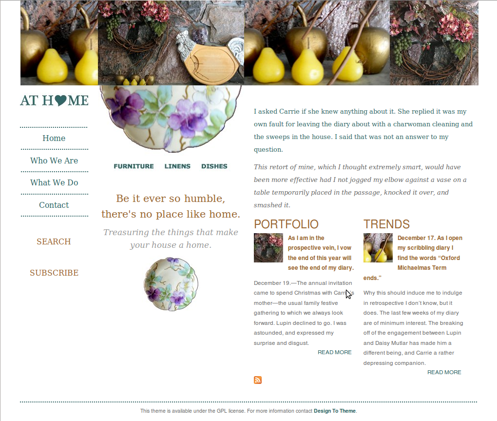
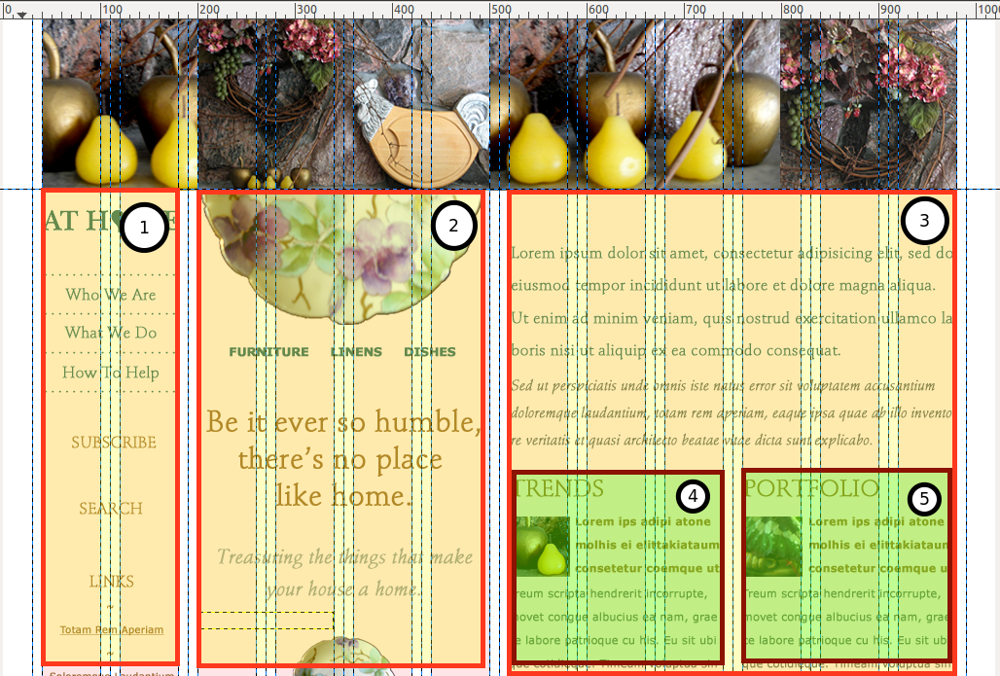

## What We're Going to Talk About

http://lb.cm/psdtotheme-acquia

1. PSD to Theme strategies.
2. Front end documentation.
3. Theming by component.
4. Useful tools.

================
## PSD to Theme Strategies

“Are you new to front-end web development? Here's a secret: no one else really knows what they're doing either.”


Nicolas Gallagher

---------------------------------------
## The Way to PSD to Theme

Theming by component:

1. Sketch out the design components.
2. Create a library of basic styles according to SMACSS convention.
3. Adjust Drupal class names to match style component names.
4. Look for bugs and refactor the component styles to match the design.

-------------
## Finding Components

To find your components, ask yourself:

1. What’s the shape?
2. What’s consistent throughout the site?
3. What can be moved like furniture?

-------------
## Let's See It in Action




===============================================================================
## 1. What's the Shape?

These are your layout rules.

-------------
## Identify the Grid


-------------
## Locate the Containers



-------------
## Sketch the Essence 


-------------
## Abstract the Essence to a Wireframe


---------
## Write Down Your Layout Rules

The shape of your web site, including the number of 
grid columns for each area.

- Banner Area -- large image - 12 grid columns
- Navigation area -- left column - 2 grid columns
- Featured area -- center column - 4 grid columns
- Content area -- right column - 6 grid columns
- Copyright area -- footer - 12 grid columns

===============================================================================
## 2. What's Consistent?

These are typically your base, or global, rules.

--------
## Find the HTML Element-ish Styles

- Headings
- Paragraphs
- Links

---------
## Write Down Your Base Rules

HTML element re-writes that are consistent from
page-to-page.

- darker gray -- #666666 -- most text "default"
- lighter gray -- #999999 -- headings
- green ish -- #336666 -- primary accent colour
- brownish -- #996633 -- secondary accent colour
- font styling: mostly serif
(etc)

===============================================================================
## 3. What Can be Moved Like Furniture?

Anything you can draw a box around is a component.

---------------------------------------
## Screen Captures Make Good Boxes 


Note: To easily identify components, start taking screen captures of your PSD file.

-----
## Write Down Your Components

Featured (4 columns) - Quotes and images

- primary decoration
- image of a plate + headings
- Sample design: component-feature-decoration-primary.png


Note: show the style guide for this


===========
## Front End Documentation

Plain Text (or Markdown) is fine!

````
Layout Rules
---------
The shape of your web site, including the number of 
grid columns for each area.

- Banner Area -- large image - 12 grid columns
- Navigation area -- left column - 2 grid columns
- Featured area -- center column - 4 grid columns
- Content area -- right column - 6 grid columns
- Copyright area -- footer - 12 grid columns

Reference:
layout-wireframe.png
layout-gridcols.png
````

======
## Converting Plain Text to Code 

Your plain text documentation can now be easily converted
into Sass (and CSS).

-------------
## 1. Layout: What's the Shape

``layout/_default.scss`` 

Create the layout rules for your grid framework of choice.

````
$ninesixty-columns: 12;

.fullwidth {
  @include grid-container;
  
  #nav {
    @include grid(2);
  }

  #featured {
    @include grid(4);
  }

  #content {
    @include grid(6);
  }
}
````
Note: Ideally the design will have used the templates for your CSS grid framework.


--------
## 2. Base: What's Consistent?

``base/_base.scss`` 

````
$default: #666666; // darker grey
$heading: #999999; // ligher grey
$accent1st: #336666; // greenish

h1, h2, h3 {
  color: $heading;
  margin-bottom: 0;
}
````

-----------
## 3. Components: Moveable Furniture

``components/_news-teaser.scss``

- Component styles should be reusable. 

````
.news-teaser {
  h2 { text-transform: uppercase; }
  p:first-child { color: $accent1st; }
  p { color: $default; }
}
````
- Put duplicate styles into variables and mixins.
- Match your file name to your style class.

===============================================================================
## Apply it to Drupal


---------------------------------------
## Build Your Drupal Site

- With your components in mind, build out your Drupal site.
- You cannot apply a style to an element which isn't being rendered in a page.

---------------------------------------
## Establish Your Theme 


---------------------------------------
## Pro Tip

Let your base theme take care of your requirements for:

- updating markup to HTML5
- grid framework
- accessibility compliance
- responsive defaults

---------------------------------------
## Adjust ``page.tpl.php``

- Apply the layout classes from your style guide.
- Insert hard-coded images.


---------------------------------------
## Launch an MVP Theme


---------------------------------------
## Apply Remaining Styles

Easy road: Alter your SCSS with ``@extend``.
````
.drupal-weird-class {
  @extend .my-awesome-class;
}
````
High road: Alter Drupal’s classes in ``template.php``

````
function THEMENAME_menu_tree($vars) {
  return '<ul class="my-awesome-class">' . $vars['tree'] . '</ul>';
}
````

---------------------------------------
## Refactor. Repeat.

- Refactor: Remove or fix styles that aren't working.
- Clear cache and see what's (now) broken.
- Repeat.

===============================================================================
## Tool Recap

1. Style guide (text + images)
1. Sass and Compass 
2. Grid frameworks
3. SMACSS

http://lb.cm/psdtotheme-acquia

------
## Style Guide

- Describe your components as text, image, and code.
- Weed your style guide daily.
- Put it as close as possible to your code.
- Video lesson: http://drupalize.me/videos/create-theme-style-guide

------
## Sass and Compass 

- Ensure your styles are modular and your CSS is re-usable.
- Use a relevant starter kit for your project.
- Your starter kit does not need to be a Drupal base theme.
- Video lesson: http://drupalize.me/series/learning-sass-and-compass

------
## Grid Frameworks

- Choose a grid frame during the design phase.
- Use the @extend directive in Sass to make your grid framework semantic.
- Video lesson: http://drupalize.me/videos/layout-rules-css-stubs

------
## Resources on Applying SMACSS to Drupal

- [CSS Coding Standards](https://drupal.org/node/1886770)
- [Applying SMACSS to Drupal](http://atendesigngroup.com/blog/applying-smacss-drupal)
- [Dominate the Theme Layer](http://munich2012.drupal.org/program/sessions/dominate-theme-layer.html)

=================
## Summary

- Theming by component makes stronger connections from PSD to Drupal easier.
- Incorporating the right tools early in the process, makes it easier to "snap" pieces together later.
- You can't theme something which doesn't exist.

=================
## Learn and Save 

http://lb.cm/psdtotheme-acquia

- All of the resources mentioned in this webinar.
- A special gift from the Drupalize.Me team.


============
## Front End Documentation

Three types of front end documentation:

- Plain text, with picture references
- Automated style guides
- Curated style pages

Note: how to document your process so that none of your design decisions are abandonned in static files.

-------
## Automated Style Guides

- [KSS](http://warpspire.com/kss/styleguides/)
- [GitHub's style guide](https://github.com/styleguide/css)
- [StyleDocco](http://jacobrask.github.io/styledocco/)
- [Kalei](http://kaleistyleguide.com/)

Sadly: they're not *quite* ready for prime time.

-------
## Curated Style Pages

- More than a [style tile](http://styletil.es/); less than a finished web site.
- [Front End Style Guides](http://24ways.org/2011/front-end-style-guides/)
- [Project Hubs](http://24ways.org/2013/project-hubs/)


---------------------------------------
## Identify Visual Assets


---------------------------------------
## Extract the Assets


