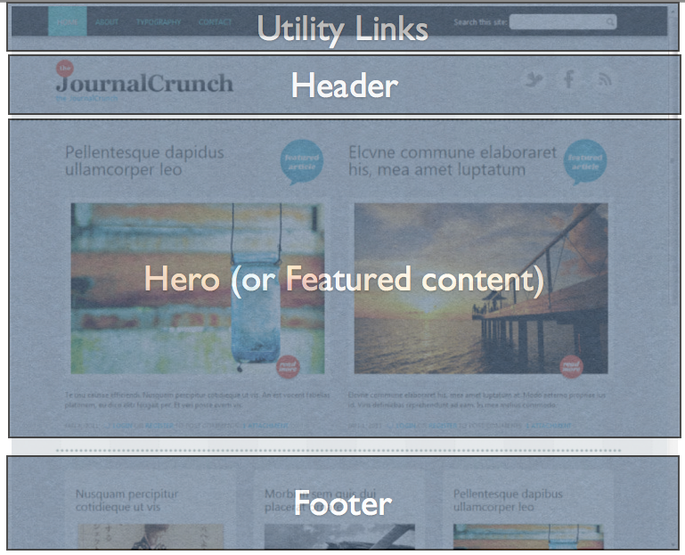
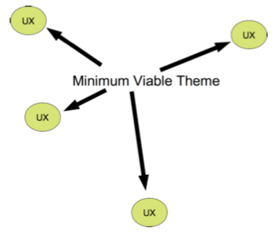
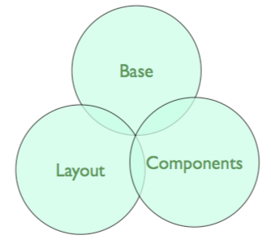

## Theming By Component

The way we perceive a design as a themer, might not be the way a site is built. Having a conversation early, and often, about
components will help us create a flexible Web site.

------
## Theming by Component

Note: we're going to start with a basic theme and then fix things until the UX is consistent with our design.

-----
## Style Framework

Note: Throughout the day we're going to focus on three areas: Base, Layout, and Component rules. I've been working on this way "forever", but it was the OOCSS culture that put a name onto the structure. There's more to it than these three rules, but this framework is a great starting point. Read www.smacss.com for more details.

-----
## Atomic Design

Web systems are built from components.

A **page** is a unit of business intent which is assembled from a series of **region** which are filled with content **blocks** and **entities* which are a collection of **fields**.

Note: The three focal points: Base/Layout/Component divide our styles into categories, but we must also work in terms of "size". I always try to theme from "biggest" to "smallest" targets. Brad Frost has given the language of "Atomic Design". Again, nothing more than a clever name for something we've been doing for ages.

-----
## Name It

You can't theme something you cannot describe with words. Being able to describe a problem with words is the gateway to coding a solution.

------
## Design Forensics

Using the Journal Crunch example, let's dissect the design into its components.

- Page
- Regions
- Collections of content (a "view") 
- Collections of fields (a "node")
- Fields

------
## Page

Image: Journal Crunch theme home page.

Note: given this page, create a simple sketch of the regions you might create for this design.

------
## Regions

Note: Regions: Utility links, Header, Hero/Featured content, Footer

------
## Collections of Content

- Static navigation ("menus")
- Dynamic lists of content ("views")

Note: On the Journal Crunch example: what are two examples of static navigation; and a dynamic list?

----
## Content Patterns

- Basic content
- Time stamped content
- Future events
- Callouts
- Resources
- Related items
- Directory of people
- Data collection
- Non-editorial (ads, logo, "decoration")
- etc!

------
## Fields

- Text
- Date
- Taxonomy
- Numbers
- Files
- Choices
- Link
- References

-----
## Resources

- [Pears](http://pea.rs) common pattern of markup and styles.
- [Atomic Design](http://bradfrostweb.com/ blog/post/atomic-web-design/)
- [Designing Web Systems](http://fourkitchens.com/presentations)

----
## Activity: Create a Pattern Vocabulary

What should/could you be looking for in your designs?

Using the following headings, write down a list of every type of component you can think of:

- Content type
- Aggregation of content
- Navigation
- Other? (create your own category!)
