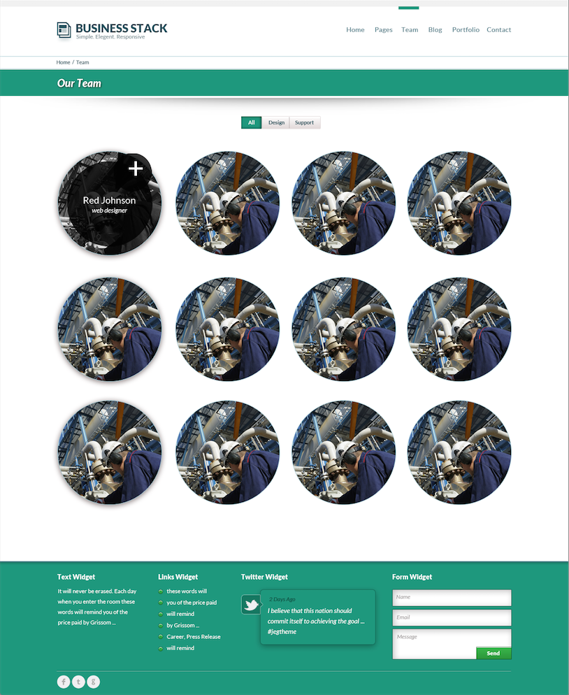
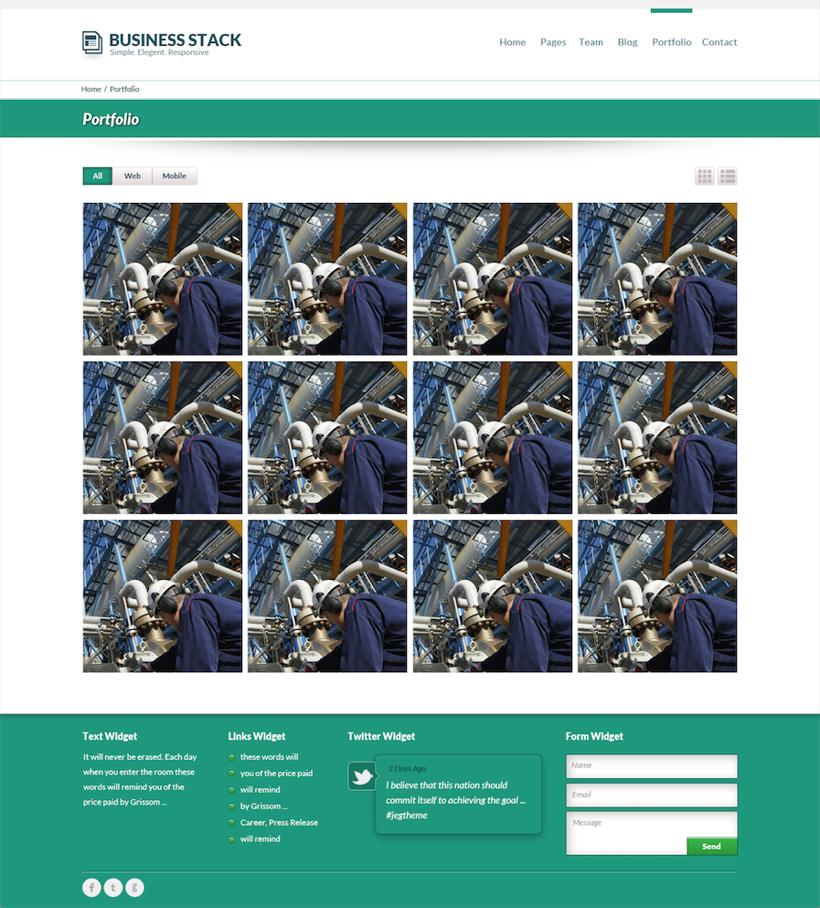
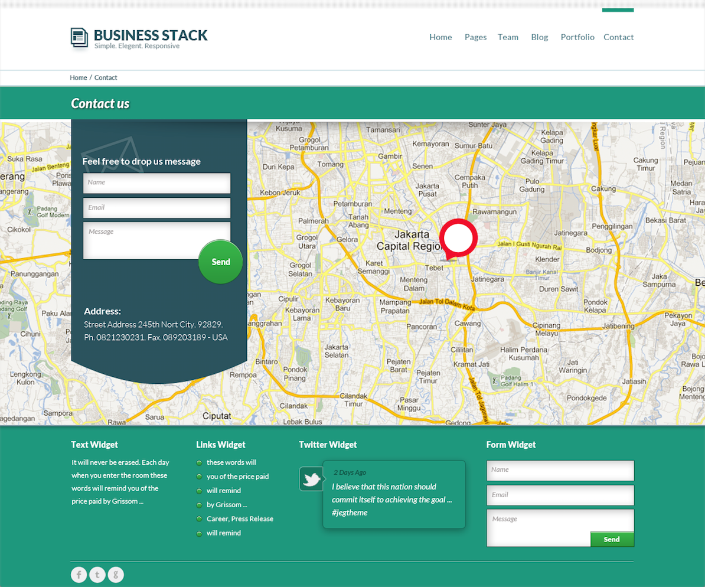
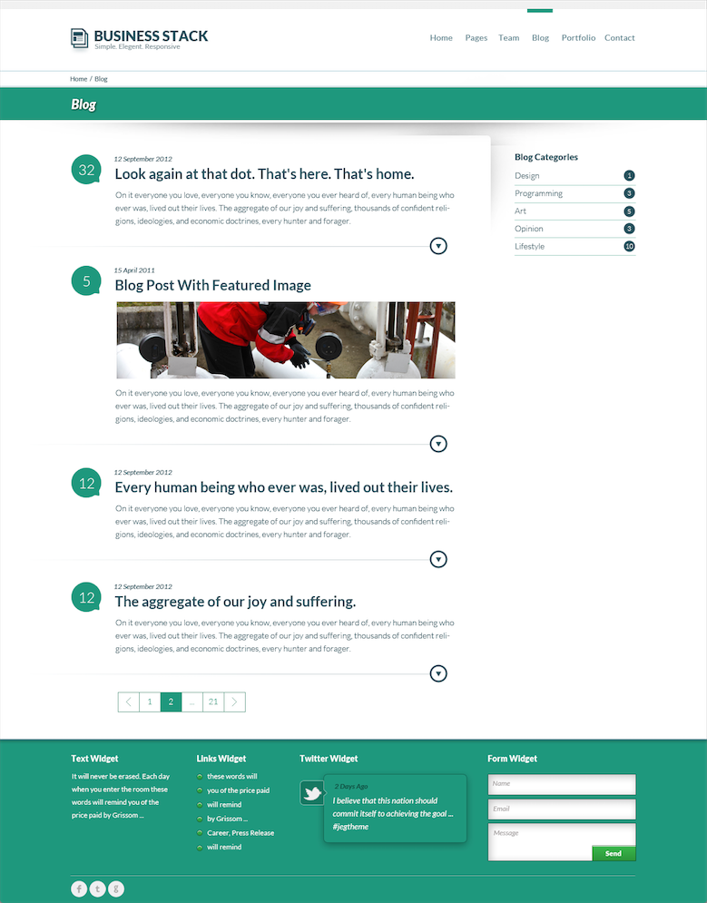
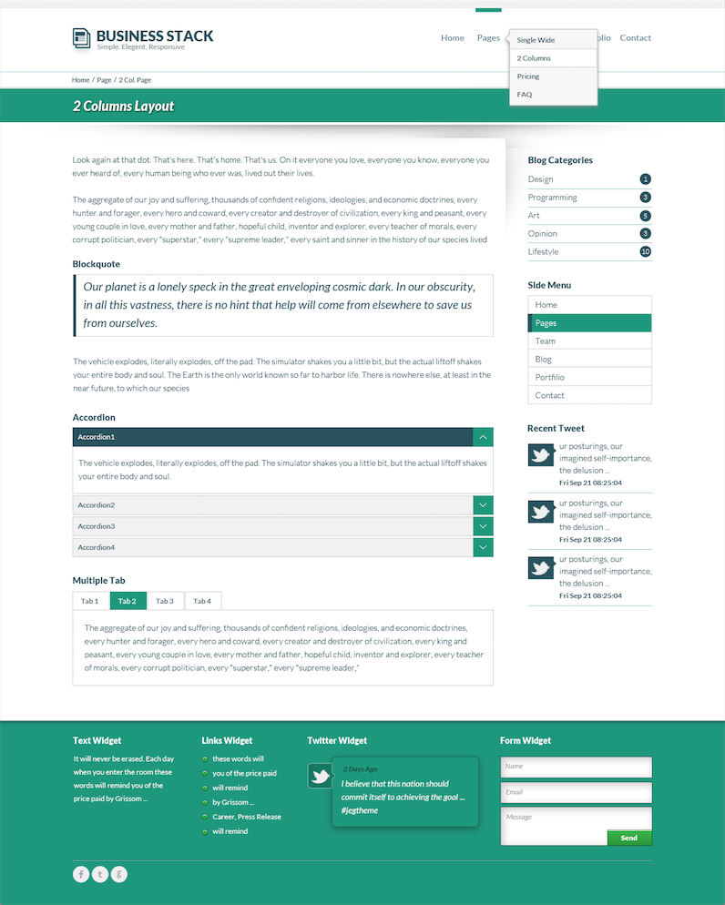

## Component / Pattern Libraries

Your web site is a collection of repeated components / patterns.

Note: although the RENDERED COMPONENT which appear on your site may LOOK unique, their underlying PURPOSE is probably described by a PATTERN which is used on other sites as well. For example: a list of things with pictures. That will show up all over the place. But how we format / decorate / display the list will change a little bit between different web sites.

---------------------------------------
## [pea.rs](http://pea.rs/)

<!-- .slide: data-background-image="assets/pears.png" -->
<!-- .slide: data-background-position="top left" -->
<!-- .slide: data-state="bgimage" -->

Note: a theme for WordPress which you can redecorate. Gives you all of the patterns / components broken down so that it's easier to find the HTML / CSS that you need to style. Intended for working quickly with WordPress.

---------------------------------------
## [patternlab](http://patternlab.io/)

<!-- .slide: data-background-image="assets/patternlab.png" -->
<!-- .slide: data-background-position="top left" -->
<!-- .slide: data-state="bgimage" -->

Note: a static site generator (PHP + Mustache templates) which has all of your patterns / components broken down. Used for rapid prototyping, but not necessarily your final build. HTML elements = atoms; Sub-components = molecules; Components = organizisms; templates; pages. You might want to use a tool like this to prototype your components, or you might want to develop your own.

---------------------------------------
## [Yahoo Design Pattern Library](http://developer.yahoo.com/ypatterns/)

<!-- .slide: data-background-image="assets/yahoo_design_patterns.png" -->
<!-- .slide: data-background-position="top left" -->
<!-- .slide: data-state="bgimage" -->

Note: An enterprise-level description of patterns and WHY you would want to use them; and how the user is expected to interact with them. Does not include code output (this is stored separatedly). This is starting to get "away" from what we'll be building.

---------------------------------------
## [UI Design Patterns](http://ui-patterns.com/)

<!-- .slide: data-background-image="assets/uipatterns.png" -->
<!-- .slide: data-background-position="top left" -->
<!-- .slide: data-state="bgimage" -->

Note: Similar to the Yahoo! Design pattern library, but this one is a community collaboration instead of an example of how ONE corporation creates interface design patterns.

---------------------------------------
## Activity: Create a Component Library

Component Libraries are a way to catalog things which will appear on a particular Web site.

Using pea.rs as a reference, let's name the components on the following design files.

Note: We'll do this as a group. You can't code something without being able to describe it with words. Being able to describe a problem with words is the gateway to coding a solution. Ignore layout and base rules. Have students write them down to the side for now. We need to know this information, but we're not going to use it yet.

------
## Team Page

<!-- .slide: data-background-image="assets/AnggaPutra_team_psd.png" -->
<!-- .slide: data-background-position="top left" -->
<!-- .slide: data-state="bgimage--reveal-activity" -->

Note: the main component is in the middle of the page. They may also identify "edge" components such as the header navigation. Discuss whether or not they think the navigation tabs above the circles are components of their own (there is not a right answer because we don't know enough about the rest of the site).

------
## Portfolio Page

<!-- .slide: data-background-image="assets/AnggaPutra_portfolio_psd.png" -->
<!-- .slide: data-background-position="top left" -->
<!-- .slide: data-state="bgimage--reveal-activity" -->

Note: Identify the portfolio squares in the middle of the page. There is also navigation tabs at the top. Seeing as the navigation tabs now appear in TWO places, we are ready to define these tabs as their own component (we want to standardize and simplify our designs). There is another pattern / component introduced on the right-hand side (list or gallery style for the portfolio items).

------
## Contact Page

<!-- .slide: data-background-image="assets/AnggaPutra_contact_psd.png" -->
<!-- .slide: data-background-position="top left" -->
<!-- .slide: data-state="bgimage--reveal-activity" -->

Note: the big green thing with the rounded bottom is a component. The background image with the map MIGHT be a component which is unique to "maps" components; or it might be a component like "banner image" which is used on other areas in the site. We don't have enough information to say for sure...so we would create a new component for both and possibly refine later. The form fields, however, are base styles. We'll talk about those later.

------
## Blog Summaries

<!-- .slide: data-background-image="assets/AnggaPutra_blog_psd.png" -->
<!-- .slide: data-background-position="top left" -->
<!-- .slide: data-state="bgimage--reveal-activity" -->

Note: Two components: the blog (variant/modifier: summary) AND sidebar navigation (which might be a variant including characteristics which are specific to the blog, but NAVIGATION is the resuable component, this is not a sub-component of blog, because then if there's another page with sidebar nav, we can't "riff on this idea" (or create variants / modifiers for it).) The gray shadow at the top right corner of the "content area" would be a layout style. It's not a component style. You might also want to have it as a Sass mixin which could be *applied* to a component. (Sometimes you don't really know. Just throw it in somewhere for now, you can always refactor later if you were wrong.)

------
## Home Page

<!-- .slide: data-background-image="assets/AnggaPutra_home_psd.png" -->
<!-- .slide: data-background-position="top left" -->
<!-- .slide: data-state="bgimage--reveal-activity" -->

Note: Not a lot shows up in the screen shot version of this. You'll want to talk about all of the ELEMENTS on the COMPONENT which is the carousel. They all work together as a family. We don't have enough information to know if those button styles appear elsewhere. We might be tempted to abstract out the buttons so that we can use them somewhere else on the site.

------
## Content Page

<!-- .slide: data-background-image="assets/AnggaPutra_page-2col_psd.png" -->
<!-- .slide: data-background-position="top left" -->
<!-- .slide: data-state="bgimage--reveal-activity" -->

Note: Point out the sidebar nav has reappeared as a component which might appear on other pages. You could talk about "component collages" and how these aren't real pages, but rather a list of all possible elements which you might want to use on your site. Component collages have become a more common handoff but they are a LOT better when you have constant communication / availability between your developer and your designer.

------
## Activity: Locate and Describe the Components on YOUR Web Site

# www.???.com

------
## Summary

- Pattern Libraries range from simple examples of rendered components, to the very "enterprise".
- Using written words to describe designs is the first step in converting a design to code.
- Components are things we lift out of our web site (as opposed to layouts which are empty, invisible containers, we can fill. Not all styles are components.
- By recognizing components in your web site, you will be able to apply HTML+CSS patterns faster in your front end work.