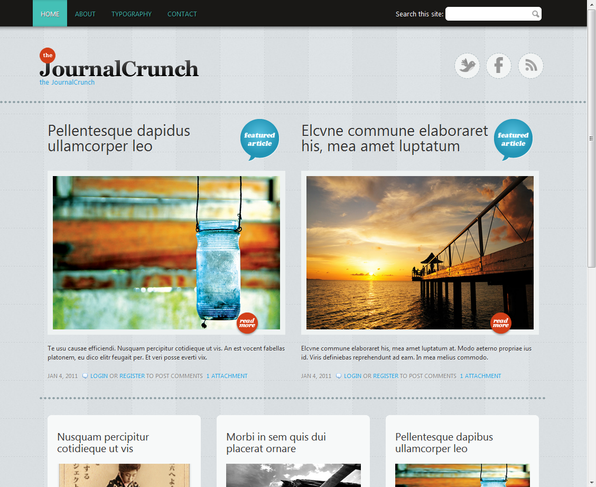

===============================================================================
## Component / Pattern Libraries

Your web site is a collection of rendered component patterns.

---------------------------------------
## [pea.rs](http://pea.rs/)

<!-- .slide: data-background-image="assets/pears.png" -->
<!-- .slide: data-background-position="top left" -->
<!-- .slide: data-state="bgimage" -->

---------------------------------------
## [patternlab](http://patternlab.io/)

<!-- .slide: data-background-image="assets/patternlab.png" -->
<!-- .slide: data-background-position="top left" -->
<!-- .slide: data-state="bgimage" -->

---------------------------------------
## [Yahoo Design Pattern Library](http://developer.yahoo.com/ypatterns/)

<!-- .slide: data-background-image="assets/yahoo_design_patterns.png" -->
<!-- .slide: data-background-position="top left" -->
<!-- .slide: data-state="bgimage" -->

---------------------------------------
## [UI Design Patterns](http://ui-patterns.com/)

<!-- .slide: data-background-image="assets/uipatterns.png" -->
<!-- .slide: data-background-position="top left" -->
<!-- .slide: data-state="bgimage" -->

---------------------------------------
## Activity: Create a Component Library

Component Libraries are a way to catalog things which will appear on a particular Web site.

Using pea.rs as a reference, let's name the components on the following two designs.

Note: You can't theme something you cannot describe with words. Being able to describe a problem with words is the gateway to coding a solution.

------
## Activity: Describe the Components on this Page

Note: given this page, create a simple sketch of the regions you might create for this design.

------
## Activity: Describe the Components on this Page

------
## Activity: What's NOT a Component?

Note: layout and base rules. Write them down to the side for now. We need to know this information, but we're not going to use it yet.

------
## Activity: Describe the Components on YOUR Web Site

# www.???.com

------
## Summary

- Pattern, or Component, Libraries range from the very simple, to the very "enterprise".
- By recognizing components in your web site, you more quickly apply HTML+CSS patterns in your front end work.
- Using written words to describe designs is the first step in converting a design to code.