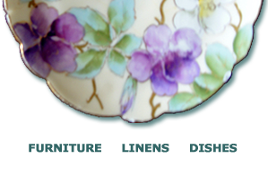
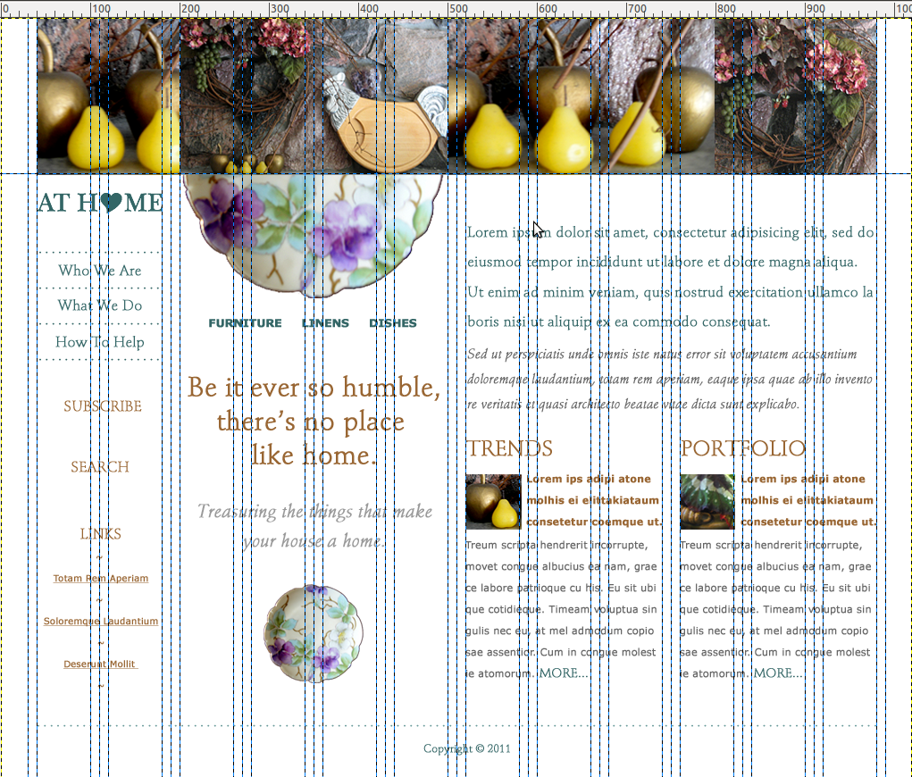
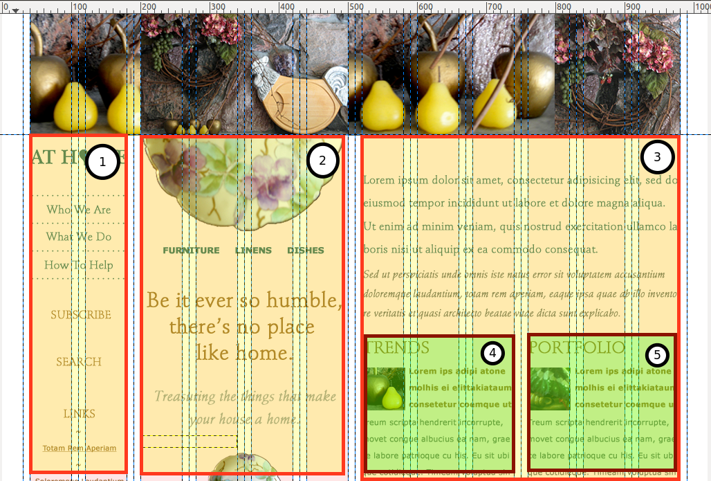
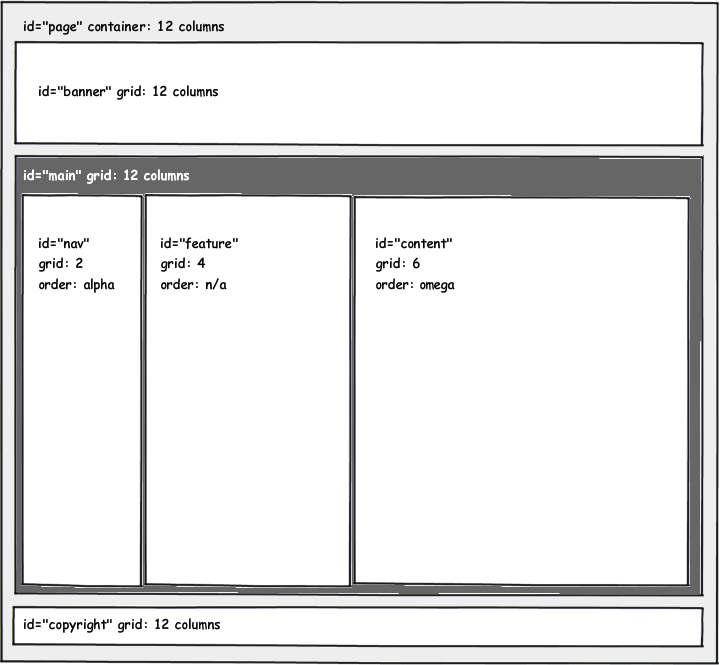

## Coding Styles

---------------------------------------
## Use Established Conventions

Frameworks allow us to quickly apply conventions to a design.

Note: Web development is like that time you realized you were a grown-up and you **could** eat cake every day for breakfast, but also understanding **why** you shouldn't.

---------------------------------------
## File Organization and Class Naming Conventions

- [OOCSS](http://github.com/stubbornella/oocss/wiki) - Object Oriented CSS - Nicole Sullivan
- [SMACSS](http://smacss.com/)* - Scalable and Modular Architecture for CSS - Jonathan Snook
- [BEM](http://bem.info/method/) - Block, Element, Modifier
- [ACSS](http://bradfrostweb.com/blog/post/atomic-web-design/) - Atomic CSS - Brad Frost

<p style="text-align: left; margin-top: 1em" class="fragment fade-in">my fave is *</p>

------------
## Workflow

1. **Define your styles in text** according to a convention.
2. Use a pattern library to **identify design components**.
3. **Stub out HTML + CSS** to display your library of styles.
4. **Refactor the component styles** until they match the design.

----------
## Sample File Naming Conventions

- ``components/style-name.scss``
  - Individual files. Match the file name to your class name.
- ``layout/X``
  - Use a directory. File names depend on your grid framework.
- ``base.scss``
  - Single file. Mostly holds variables.


---------------------------------------
## What are Your Components?

Anything you can draw a box around is a component.

-----
## Write Down Your Components

- Component Name
- Width (per build/break point if relevant)
- Terse description
- Characteristics
- Screen shot

-----
## Sample Component

````
Featured (4 columns) - Quotes and images

- primary decoration
- image of a plate + headings
- Sample design: component-feature-decoration-primary.png
````




-------------
## What's the Shape?

These are your layout rules.

-------------
## Identify the Grid

<!-- .slide: data-background-image="assets/domicile-grid-overlay.png" -->
<!-- .slide: data-background-position="top left" -->
<!-- .slide: data-state="bgimage" -->



Note: the domicile design with a grid overlay showing 12 grid columns and gutters

-------------
## Locate the Containers

<!-- .slide: data-background-image="assets/domicile-regions.png" -->
<!-- .slide: data-background-position="top left" -->
<!-- .slide: data-state="bgimage" -->



Note: the domicile design with three layout columns highlighted in yellow

-------------
## Abstract the Design to a Sketch

<!-- .slide: data-background-image="assets/domicile-wireframe.png" -->
<!-- .slide: data-background-position="top left" -->
<!-- .slide: data-state="bgimage" -->



Note: the domicile design as a wireframe

---------
## Write Down Your Layout Rules

- Name
- Terse description
- Number of grid columns for each area

````
- Banner Area -- large image - 12 grid columns
- Navigation area -- left column - 2 grid columns
- Featured area -- center column - 4 grid columns
- Content area -- right column - 6 grid columns
- Copyright area -- footer - 12 grid columns
````

---------------------------------------
## What's Consistent?

Styles which can be applied across multiple components, for example the color of a heading, are your base rules.


---------
## Write Down Your Base Rules

Design elements which are consistent from page-to-page.

````
Colors:
- darker gray -- #666666 -- most text "default"
- lighter gray -- #999999 -- headings
- green ish -- #336666 -- primary accent colour
- brownish -- #996633 -- secondary accent colour
- font styling: mostly serif
(etc)
````

=======
## Sample Code

-------------
## Layout Rules

``layout/_default.scss`` 

Create the layout rules for your grid framework of choice.

````
$ninesixty-columns: 12;

.fullwidth {
  @include grid-container;
  
  #nav {
    @include grid(2);
  }

  #featured {
    @include grid(4);
  }

  #content {
    @include grid(6);
  }
}
````
Note: Ideally the design will have used the templates for your CSS grid framework.


--------
## Base Rules

``base/_base.scss`` or ``_base.scss``

````
$default: #666666; // darker grey
$heading: #999999; // ligher grey
$accent1st: #336666; // greenish

h1, h2, h3 {
  color: $heading;
  margin-bottom: 0;
}
````

-----------
## Component Rules

``components/_news-teaser.scss``

````
.news-teaser {
  h2 { text-transform: uppercase; }
  p:first-child { color: $accent1st; }
  p { color: $default; }
}
````
- Put duplicate styles into variables and mixins.
- Match the file name to the class name.

-----------
## Summary

- Convert your design into words.
- Group the words according to an organizational framework, such as SMACSS.
- Write the pseudo-code for your styles.
- Convert the pseduo-code to a prototype, using a CSS (grid) framework.
- Opt for many small files to avoid version control conflicts when refactoring.
- Iterate and improve in the browser.