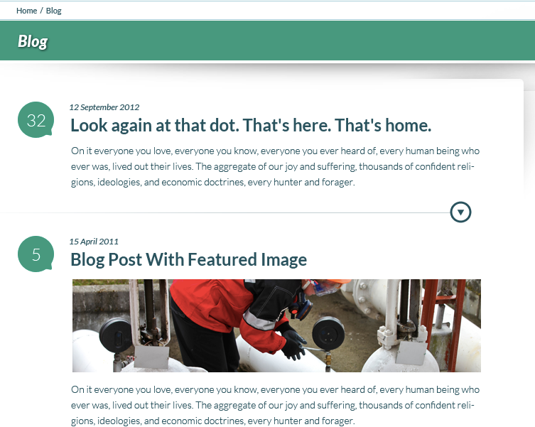
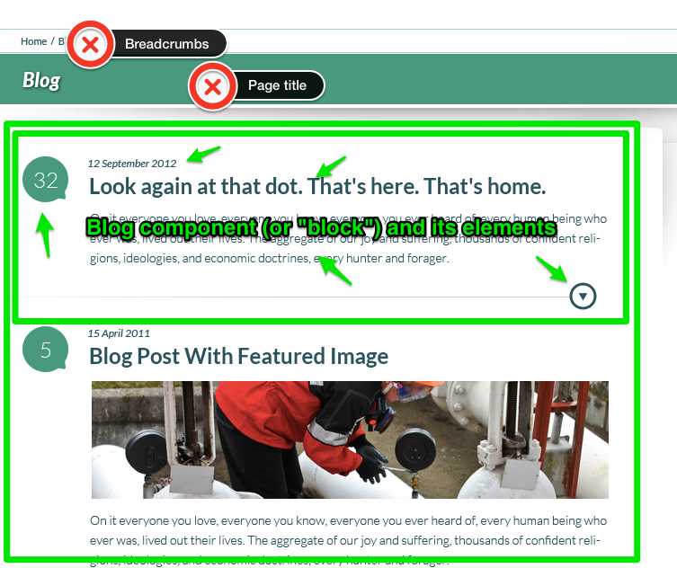
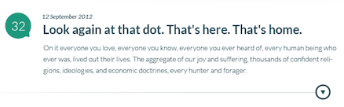

## Rules for Components

Anything you can draw a box around is a component.

<div class="fragment">Sort of.</div>

-----
## Blog Example

<!-- .slide: data-background-image="assets/AnggaPutra_blog_psd.png" -->
<!-- .slide: data-background-position="top left" -->
<!-- .slide: data-state="bgimage" -->

-----
## Find the Smallest <br />Repeatable Unit for BLOG



Note: This is THREE components; or perhaps TWO components and one BASE style.

-----
## Only the Blog Summaries Repeat



Note: The blog component has five sub-components or elements: title, date, summary text, number of comments, show whole post icon.

-----
## Component Descriptions

- Component Name
- Width (including build/break point details if relevant)
- Terse description
- Characteristics
- Screen shot

-----
## Sample Component Description

````
Blog summary (4 columns)

- Blog title
- Date
- Number of comments
- Text summary
- "Expand" icon

Sample design: component-blog-summary.png

````




-----------
## Sample Component Style

File name: ``components/_blog.scss``

Sample Sass content:

````
.blog {
  __title {
    // defaults are fine
  }
  __date {
    @extend .subtitle;
  }
  __summary {
    // defaults are fine
  }
  __comments {
    background-image: url('balloon.png');
    color: $secondary;
  }
  __expand {
    background-image: url('arrow-down.png');
    border-bottom: 1px solid $maincolor;
  }
}
````

Note: trying to follow BEM conventions for naming. http://bem.info/method/definitions/

------------
## Activity

Write down the components for your designs.

You may want to try writing some pseudo-Sass for each component broken into "block", "element", and "modifier".

-----------
## Summary

- Most of your style rules will be components (component-based web design!)
- Use the component name for both the class name and the file name so that it is easy to find later.
- Where possible: abstract related styles and put them into variables and mixins for easier re-use.
