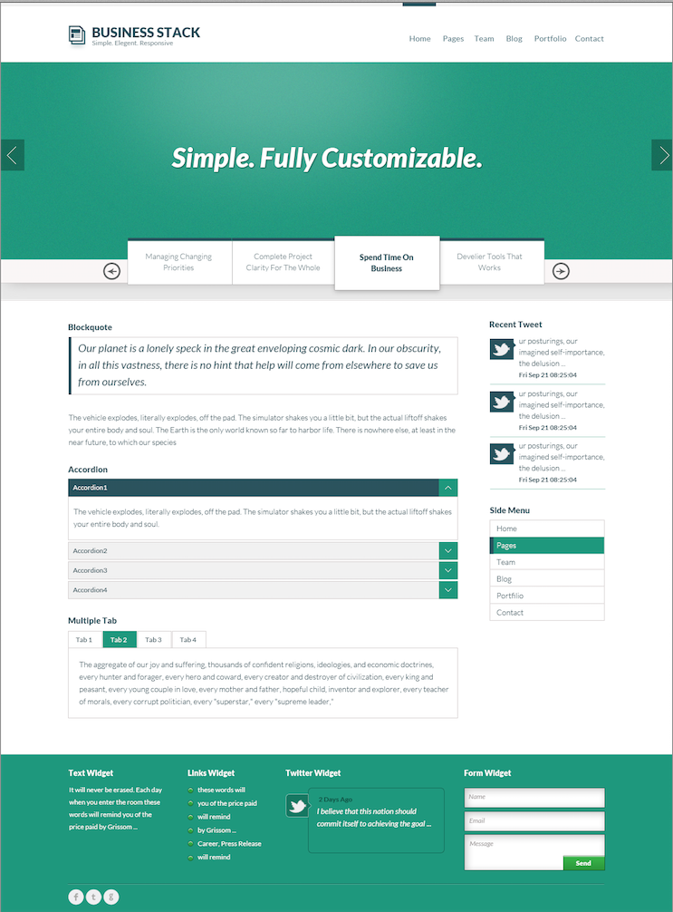
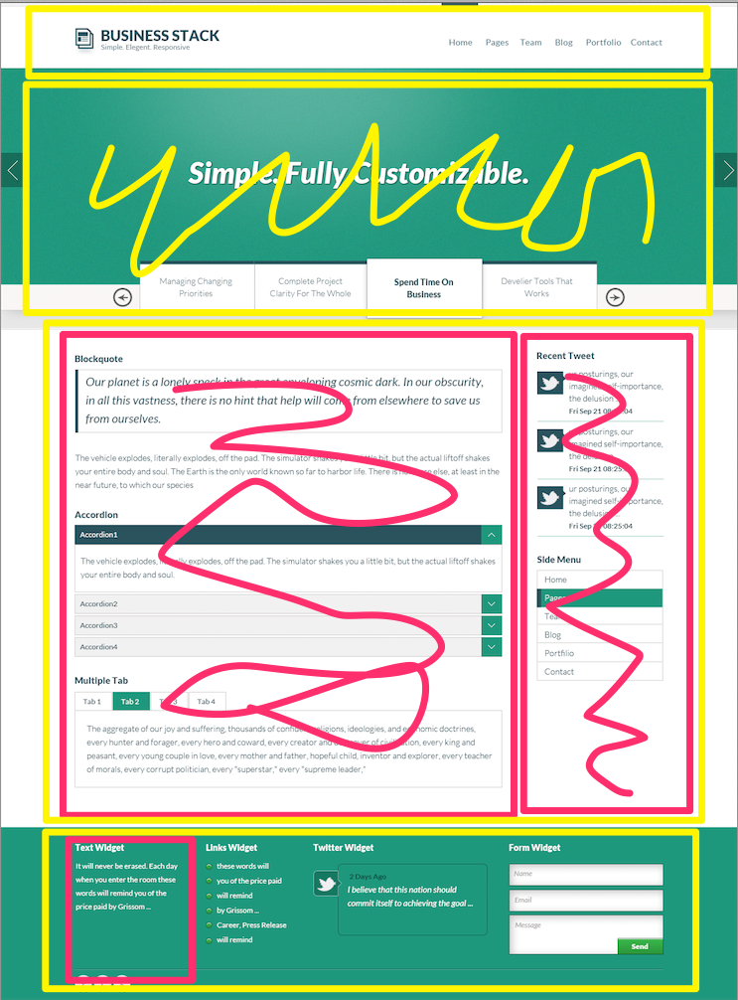
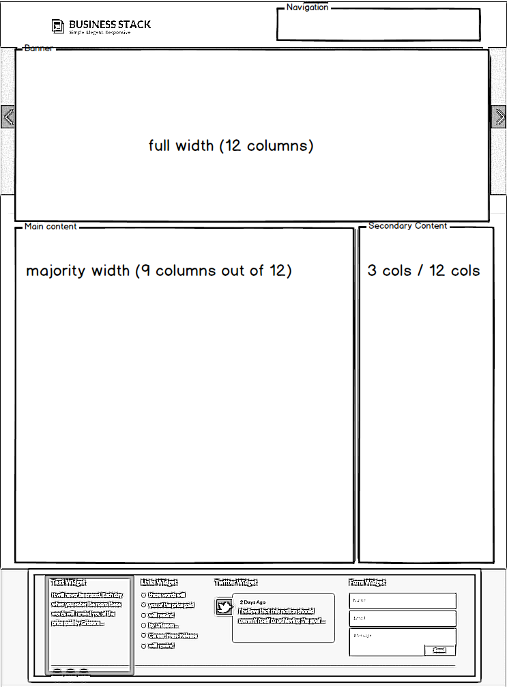

## Rules for Layout

The shapes which your components fit into.

-------------
## Home Page

<!-- .slide: data-background-image="assets/AnggaPutra_home_psd.png" -->
<!-- .slide: data-background-position="top left" -->
<!-- .slide: data-state="bgimage" -->



Note: 2 column design in the main page. No obvious grid if we take a ruler to the edges. Consider unifying the columns for ease later on.

-------------
## Locate the Containers

<!-- .slide: data-background-image="assets/AnggaPutra_home_layout.png" -->
<!-- .slide: data-background-position="top left" -->
<!-- .slide: data-state="bgimage" -->



Note: color over your design to identify the regions

-------------
## If It Helps: Re-Sketch

<!-- .slide: data-background-image="assets/AnggaPutra_sketched.png" -->
<!-- .slide: data-background-position="top left" -->
<!-- .slide: data-state="bgimage" -->



Note: use whatever notes you need to make sense of the picture

---------
## Write Down Your Layout Rules

- Name
- Terse description
- Number of grid columns for each area

````
- Banner Area -- large image - 12 grid columns
- Secondary content -- right column - 3 grid columns
- Main area -- left column - 9 grid columns
````

-------------
## Layout Rules

``layout/_default.scss`` 

Create the layout rules for your grid framework of choice.

````
$ninesixty-columns: 12;

.fullwidth {
  @include grid-container;
  
  .banner {
    @include grid(2);
  }

  .content--primary {
    @include grid(9);
  }

  .content--secondary {
    @include grid(3);
  }
}
````
Note: Ideally the design will have used the templates for your CSS grid framework.

----------------
## Activity

Write down all of the layout rules for your design.

These will be the containers you place your components into.