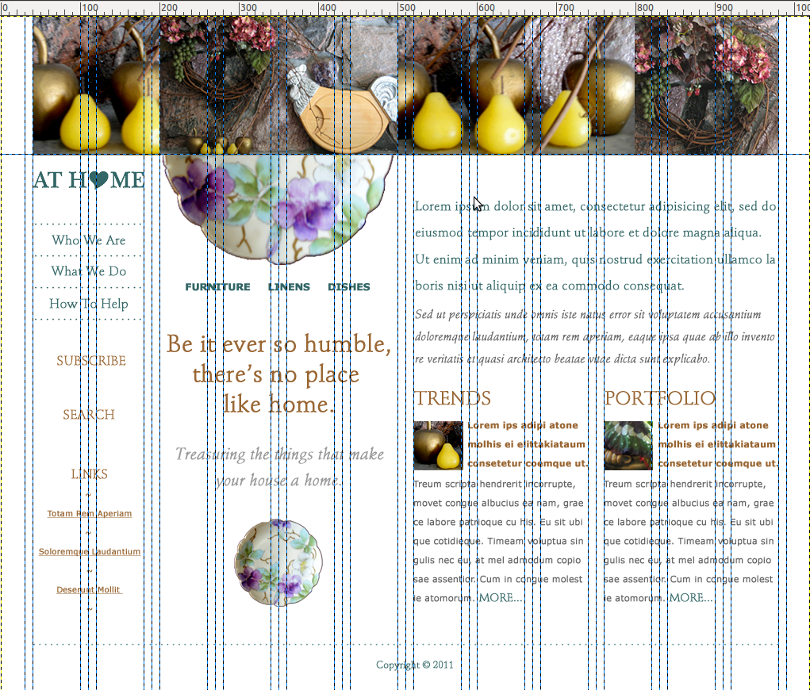

## Rules for Layout

The shapes which your components fit into.

-------------
## Identify the Grid

<!-- .slide: data-background-image="assets/domicile-grid-overlay.png" -->
<!-- .slide: data-background-position="top left" -->
<!-- .slide: data-state="bgimage" -->



Note: the domicile design with a grid overlay showing 12 grid columns and gutters

-------------
## Locate the Containers

<!-- .slide: data-background-image="assets/domicile-regions.png" -->
<!-- .slide: data-background-position="top left" -->
<!-- .slide: data-state="bgimage" -->


Note: the domicile design with three layout columns highlighted in yellow

-------------
## Abstract the Design to a Sketch

<!-- .slide: data-background-image="assets/domicile-wireframe.png" -->
<!-- .slide: data-background-position="top left" -->
<!-- .slide: data-state="bgimage" -->


Note: the domicile design as a wireframe

---------
## Write Down Your Layout Rules

- Name
- Terse description
- Number of grid columns for each area

````
- Banner Area -- large image - 12 grid columns
- Navigation area -- left column - 2 grid columns
- Featured area -- center column - 4 grid columns
- Content area -- right column - 6 grid columns
- Copyright area -- footer - 12 grid columns
````

-------------
## Layout Rules

``layout/_default.scss`` 

Create the layout rules for your grid framework of choice.

````
$ninesixty-columns: 12;

.fullwidth {
  @include grid-container;
  
  #nav {
    @include grid(2);
  }

  #featured {
    @include grid(4);
  }

  #content {
    @include grid(6);
  }
}
````
Note: Ideally the design will have used the templates for your CSS grid framework.