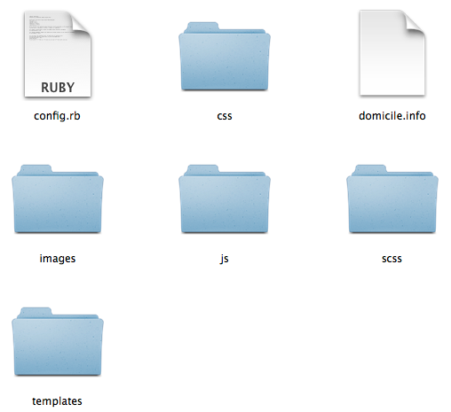
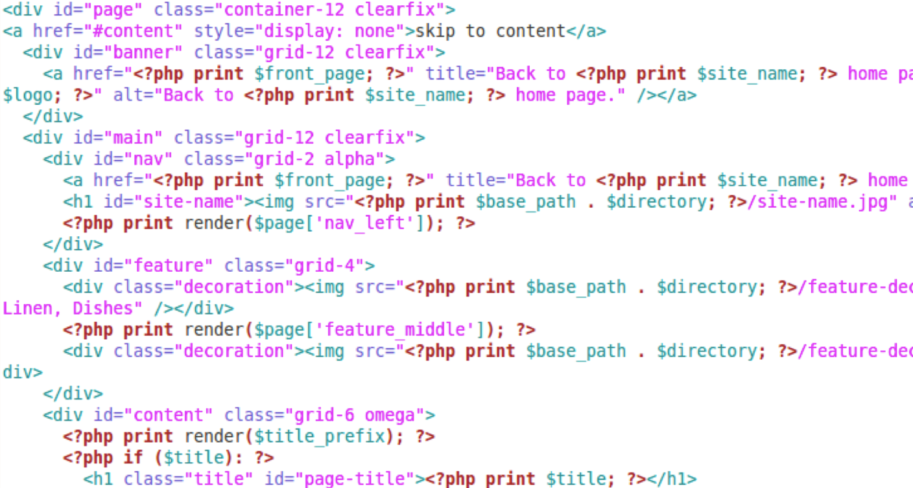

## Building Your Theme

----------
## Sample File Naming Conventions

- ``components/_style-name.scss``
  - Individual files. Match the file name to your class name.
- ``layout/X``
  - Use a directory. File names depend on your grid framework.
- ``base.scss`` or ``base/X``
  - Single file. Mostly holds variables. *OR* a directory.

Note: Opt for many small files to avoid version control conflicts when refactoring.

---------------------------------------
## Build Your Drupal Site

- With your components in mind, build out your Drupal site.
- You cannot apply a style to an element which isn't being rendered in a page.

---------------------------------------
## Establish Your Theme 



---------------------------------------
## Pro Tip

Let your base theme take care of your requirements for:

- updating markup to HTML5
- grid framework
- accessibility compliance
- responsive defaults

Sort your styles according to a convention which is relevant to your CMS.

---------------------------------------
## Organize the Component Files In Your Theme

````
mytheme/scss/components/
  _blog.scss
  _gallery-item.scss
  _portfolio-item.scss
mytheme/scss/layout/
  _default.scss
  _single-column.scss
mytheme/scss/base.scss
mytheme/scss/styles.scss (pulls in all partials)
````

Tip: How does HTML "work" for your CMS of choice? How will you tie these styles to your CMS?

---------------------------------------
## Adjust ``page.tpl.php``

- Apply the layout classes from your style guide.
- Insert hard-coded images.



---------------------------------------
## Launch an MVP Theme


---------------------------------------
## Apply Remaining Styles

Easy road: Alter your SCSS with ``@extend``.
````
.drupal-weird-class {
  @extend .my-awesome-class;
}
````
High road: Alter Drupal’s classes in ``template.php``

````
function THEMENAME_menu_tree($vars) {
  return '<ul class="my-awesome-class">' . $vars['tree'] . '</ul>';
}
````

---------------------------------------
## Refactor. Repeat.

- Refactor: Remove or fix styles that aren't working.
- Clear cache and see what's (now) broken.
- Repeat.

----------
## Examples of Conventions<br />Applied to Real Projects

- [Applying SMACSS to Drupal](http://atendesigngroup.com/blog/applying-smacss-drupal)
- [CSS Architecture for Drupal 8](https://drupal.org/node/1887918)
- [WordPress and SMACSS](http://peterwilson.cc/specificity-smacss-and-wordpress/)
- [Pure - a theme](http://purecss.io/)

-----------
## More On Sass and Compass

- http://drupalize.me/series/learning-sass-and-compass
- http://drupalize.me/series/psd-drupal-theme


Note: about working with Sass, Compass and what you need to install and run at the command line to get stuff working.

-----------
## Summary

- We use conventions to help us make decisions in a consistent manner.
- We like artificial constraints when they help us.
- We follow a process which allows us to refactor our work as needed.
- We aim to sort our styles in a way which allows us to refactor easily.

Note: dealing with git conflicts
