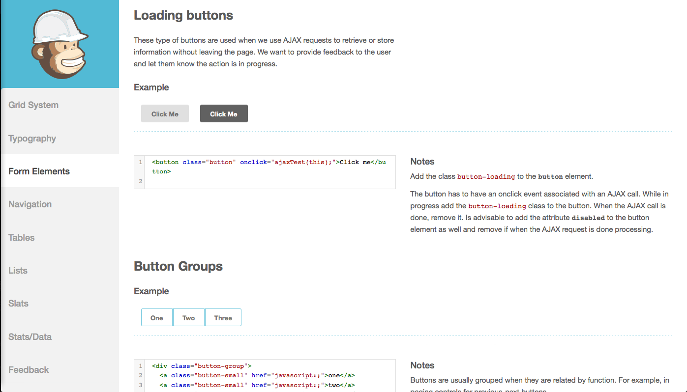
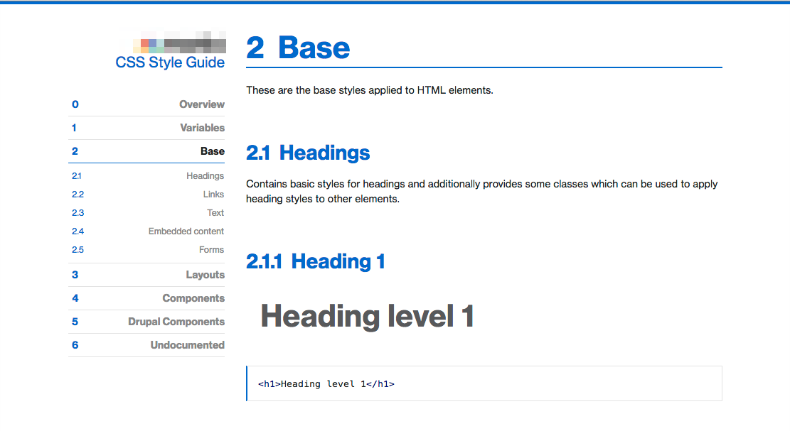
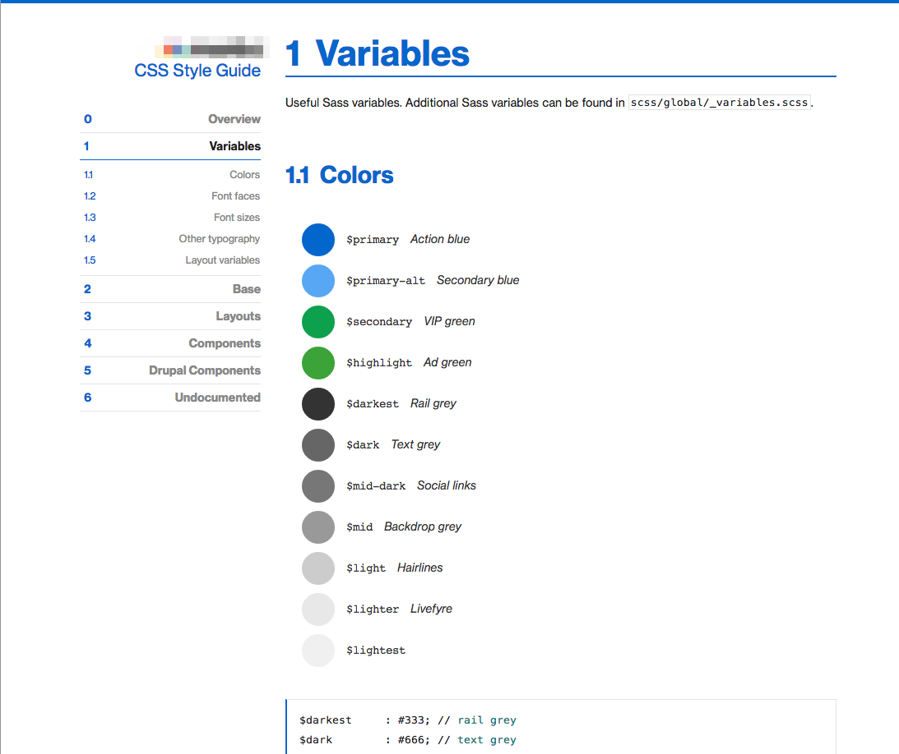

## Where Next?

After you've finished building your theme, you should create a human-readable summary of your styles.

We'll refer to this summary Style Guide.

----------------------------------------------------------------
## Style Guides

There are essentially three types of style guides:

- Plain text, with screen shot / picture references
- Curated style pages
- Automated style guides

----------------------------------------------------------------
## Style Guide: Curated Style Pages

A living style guide is ideal. 

It gives examples of what the rendered CSS should look like in a browser. 

These are generally compiled at the end of the design phase; however, front end developers should consider having an in-code style guide as well (or instead of) this type of style guide.

Article: http://24ways.org/2011/front-end-style-guides/

----------------------------------------------------------------
## Examples of Curated Style Pages

Examples:

- [Herokuapp](http://sfdc-styleguide.herokuapp.com/)
- [GitHub](https://github.com/styleguide/css/1.0)
- [MailChimp](https://ux.mailchimp.com/patterns/)
- [Code for America](http://style.codeforamerica.org/)
- [Starbucks](http://www.starbucks.com/static/reference/styleguide/)
- [Drupalize.Me (unfinished)](http://justinharrelllullabot.github.io)

----------------------------------------------------------------
## Sample Curated Style Page

----------------------------------------------------------------
## Style Guide: Automated Style Guides

Documentation should be put as close as possible to the place where it will be used. Any time documentation is abstracted, or re-written, and put into a different location it risks becoming out of date. The following automated style guides are still "works in progress" and not necessarily current best practices for compiling style-related documentation.

- [kss-node](https://github.com/hughsk/kss-node) which is based on [Knyle Style Sheets](http://warpspire.com/kss/styleguides/)
- [Tdcss.js](http://jakobloekke.github.io/tdcss.js/)
- [Kalei Style Guide](http://kaleistyleguide.com/)
- [StyleDocco](http://jacobrask.github.io/styledocco/)
- [Pattern-Primer](https://github.com/adactio/Pattern-Primer)

----------------------------------------------------------------
## Sample Automated Style Guide

----------------------------------------------------------------
## Sample Automated Style Guide

